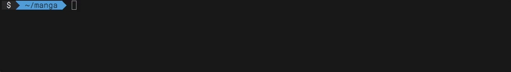

<h1 align="center">
    
</h1>

> CLI for comfortable manga download


[](https://www.npmjs.com/package/mangareader-dl)
[](https://github.com/jneidel/mangareader-dl/blob/master/licence)
[](https://github.com/jneidel/dotfiles/blob/master/.eslintrc)
<!--[](https://travis-ci.org/jneidel/mangareader-dl)-->

Convenient mass downloading from [mangareader.net](https://www.mangareader.net/) and other [supported sites](#supported-sites), easily download new chapters or resume downloads.



```zsh
$ mangareader-dl naruto/699 -do .

$ ls ./naruto
#=> naruto-699.cbz naruto-700.cbz
```

## Features

- Download all available chapters
- Resume downloads
- Easily download new chapters
- Set download location
- Configurable defaults
- Clean, informative interface

## FAQ

<details>
<summary><strong>Which comic book reader do you use?</strong></summary>
<br>
I use <a href="https://www.yacreader.com/">YACReader</a> (GNU/Linux, Mac, Win), which I very much recommend.
<br><br>
</details>

<details>
<summary><strong>Why not just read online?</strong></summary>
<br>
<ul>
  <li><strong>Ads:</strong> No ads.</li>
  <li><strong>Keyboard Shortcuts:</strong> Using YACReader I can can scroll/flip a page by only pressing `spacebar` wheres in a browser I would need my to use my mouse.</li>
  <li><strong>Zoom:</strong> Using YACReader I can set a consistent zoom, that does not change on page flip and is easier scrollable than using the mouse or arrow keys.</li>
  <li><strong>Offline:</strong> A slow internet connection won't impact loading times. Access your manga everywhere.</li>
  <li><strong>State:</strong> YACReader saves how far you've read automatically, no need to manage bookmarks.</li>
  <li><strong>Battery:</strong> Turning off WiFi and not running your draining browser but a lightweight app like YACReader will be easy on your battery.</li>
  <li><strong>Convenience:</strong> Your reading is delayed only by the time it takes to download the first chapter. After that, judge for yourself.</li>
<br>
</details>

<details>
<summary><strong>Isn't <code>mangareader-dl</code> too long to type?</strong></summary>
<br>
That's why I use it with an alias.
<br><br>
In your shell config (<code>~/.bashrc</code>, <code>~/.zshrc</code>, etc.):
<br>
<code>alias manga="mangareader-dl"</code>
<br>
Then you can use <code>$ manga</code> instead of <code>$ mangareader-dl</code>.
<br>
I don't use <code>$ manga</code> directly, because I don't to overwrite other binaries that eventually use this generic name.
</details>

<details>
<summary><strong>How do you use this CLI?</strong></summary>
<br>
These are the aliases that I'm using:
<br>
<code>alias manga="mangareader-dl --debug"</code> - to shorten the name
<br>
<code>alias mangala="manga update check"</code> - to check if new chapters are available for dl
<br>
<code>alias mangaup="manga update --silent 1>> ~/manga/updates 2>&1 &"</code> - to download new chapters and append what was downloaded to a text file
</details>

## Install

[](https://www.npmjs.com/package/mangareader-dl)

```zsh
$ npm i -g mangareader-dl
```

## Usage

```
  mangareader-dl: CLI for comfortable manga download

  Usage
    $ mangareader-dl <manga>

  Commands
    <manga> Manga to download
    list    List downloaded manga
    config  Set defaults
    update  Update subscribed manga

  Options, Sub-commands
    <manga>
      -o, --out       Set output path
      -d, --dir       Download into 'path/manga-name'
      -p, --provider  Set download site
      -f, --force     Overwrite history
      -s, --subscribe Subscribe to new chapters
      -m, --micro     Micro progress bar
    list
      -l, --latest    Highlight if new chapters are available
      reset           Reset non-subscribed manga
        -f, --force   Reset history
    config
      -o, --out       Set default output path
      -d, --dir       Enable/disable dir option
      -p, --provider  Set default provider
      reset           Reset config
    update
      -m, --micro     Micro progress bar
          --silent    Hide progress bar
      check           Check if new chapters are available
    --version         Show version
    --help            This help message
    --debug           Throw errors locally

  Examples
    $ mangareader-dl mangareader.net/naruto/100 -do .
    => Download naruto chapter 100+ into cwd

    $ mangareader-dl naruto -mp mangareader
    => Download naruto from mangareader.net in micro mode

  For the full documentation please refer to:
  https://github.com/jneidel/mangareader-dl
```

## Examples

These examples will showcase common use cases. View the [API docs](#commands) for more info on the individual commands.

**Download starting at given chapter:**

```zsh
$ mangareader-dl naruto/100

# Output path: './'
```

See:

- [`<manga>`](#mangachapter-options)

**Set output directoy:**

```zsh
$ mangareader-dl naruto -do ~/manga

# Output path: '~/manga/naruto'
```

See:

- [`--out`](#--out-path)
- [`--dir`](#--dir)

**Continue download from history:**

For each manga the `chapter`, `provider` and `path` are saved. So the following download:

```zsh
$ mangareader-dl naruto/10 -o naruto

# Output path (same as for next two): './naruto'
```

can be resumed with:

```zsh
$ mangareader-dl naruto
```

If you need to re-download something, just overwrite the history with [`--force`](#--force):

```zsh
$ mangareader-dl naruto/10 -fo naruto
```

See:

- [`list`](#list)
- [`--force`](#--force)

**Download from different site:**

```zsh
$ mangareader-dl naruto -p readmng
# Or specifying the site via url
$ mangareader-dl https://www.readmng.com/naruto
```

See:

- [supported sites](#supported-sites)
- [`--provider`](#--provider-site)

**Update manga:**

After marking a manga with the [`--subscribe`](#--subscribe) flag at the initial download:

```zsh
$ mangareader-dl naruto -s
```

You can download new releases (for all marked manga) with:

```zsh
$ mangareader-dl update
```

See:

- [update](#update)
- [`--subscribe`](#--subscribe)

## Commands

### \<manga>[/chapter] [options]

<table><tr>
  <td>
    options:
    <code><a href="#--out-path">--out</a></code>,
    <code><a href="#--dir">--dir</a></code>,
    <code><a href="#--provider-site">--provider</a></code>,
    <code><a href="#--force">--force</a></code>,
    <code><a href="#--subscribe">--subscribe</a></code>,
    <code><a href="#--micro">--micro</a></code>,
    <code><a href="#--debug">--debug</a></code>
  </td>
</tr></table>

Url or name of manga to download.

```zsh
$ mangareader-dl shingeki-no-kyojin # same as
$ mangareader-dl https://www.mangareader.net/shingeki-no-kyojin
```

A chapter can be specified using a `/` after the manga name: `shingeki-no-kyojin/100`.

```zsh
$ mangareader-dl shingeki-no-kyojin/100
```

Manga are downloaded in the `.cbz` (comic book zip) format.

**Possible formats:**

- `shingeki-no-kyojin`
- `mangareader.net/shingeki-no-kyojin`
- `www.mangareader.net/shingeki-no-kyojin`
- `http://www.mangareader.net/shingeki-no-kyojin`
- `https://www.mangareader.net/shingeki-no-kyojin`

### list

<table><tr>
  <td>
    options:
    <code>--latest</a></code>,
    <code><a href="#--force">--force</a></code>,
    <code><a href="#--debug">--debug</a></code>
  </td>
</tr></table>

Output the history of downloaded manga, as well as their last chapter, provider and location on disk.

This list is used for continuing downloads.

```zsh
$ mangareader-dl list

# ❯ Downloaded manga:
#     onepunch-man       137 [mangareader /Users/jneidel/manga/onepunch-man]
#     platinum-end        28 [readmng     /Users/jneidel/manga/platinum-end]
#   ✓ shingeki-no-kyojin 104 [mangareader /Users/jneidel/manga/shingeki-no-kyojin]
```

To continue the download of `onepunch-man` starting at chapter 138 execute:

```zsh
$ mangareader-dl onepunch-man
```

The `✓` in the second output above specifies whenever a manga has been [`--subscribe`](#--subscribe)d to.

**Color up-to-date manga:**

To check whenever a manga is at its latest chapter pass the `--latest` (`-l`) option.

Green manga are up-to-date, red ones arn't.

**Reset history:**

Soft reset (keep [`--subscribe`](#--subscribe)d manga):

```zsh
$ mangareader-dl list reset
```

Hard reset:

```zsh
$ mangareader-dl list reset -f
```

### config [options]

Update the global defaults by specifying them as options:

```zsh
$ mangareader-dl config -deo ~/manga -p mangareader
```

**Available options:**

| option | parameter | default |
|--|--|--|
| [`--out`](#--out-path) | `<path>` | `./` |
| [`--provider`](#--provider-site) | `<site>` | `mangareader` |
| [`--dir`](#--dir) | `true` / `false` | `false` |

**Current config:**

```zsh
$ mangareader-dl config

Current configuration:
  --out: /Users/jneidel/manga
  --dir: true
  --provider: mangareader
```

**Config location:**

The cli checks if `~/.mangareader-dl.json` exists and otherwise writes to a local file. If you want your config and history to persit just create the global settings file:

In `~/.mangareader-dl.json`:

```json
{
  "config" : {},
  "history": {}
}
```

**Reset config:**

```zsh
$ mangareader-dl config reset
```

### update

<table><tr>
  <td>
    options:
    <code><a href="#--micro">--micro</a></code>
    <code>--silent</code>,
    <code><a href="#--debug">--debug</a></code>
  </td>
</tr></table>

Download new chapters for all manga that have been [`--subscribe`](#--subscribe)d to.

```zsh
$ mangareader-dl update
```

Performs a n-time lookup for new chapters on all [`--subscribe`](#--subscribe)d manga, followed by the download of these chapters into their provided paths.

**Example:**

`~/.mangareader-dl.json`:

```json
{
  "config": {...},
  "history": {
    "platinum-end": {
      "chapter": 20,
      "path": "/Users/jneidel/manga/platinum-end",
      "provider": "readmng",
      "subscribe": true
    },
    "onepunch-man": {
      "chapter": 136,
      "path": "/Users/jneidel/manga/onepunch-man",
      "provider": "mangareader",
      "subscribe": true
    },
  }
}
```

Latest chapter of `platinum-end` on `readmng` is `28`.

Latest chapter of `onepunch-man` on `mangareader` is `137`.

```zsh
$ mangareader-dl update

# Downloads:
#   'platinum-end' chapter 21-28
#   'onepunch-man' chapter 137
```

**Check if new chapters are available:**

```
$ mangareader-dl update check

# ❯ New chapters are available for:
#   boku-no-hero-academia
#   dr-stone
#   haikyuu
#   shokugeki-no-soma
# ❯ Update using: $ mangareader-dl update
```

**Hide progress bar:**

For redirecting the output cleanly into a file use the `--silent` flag.

```zsh
$ mangareader-dl update --silent >> ~/manga/updates.txt &

# downloads updates in the background
# and adds the list of update
# chapters to ~/manga/updates.txt

$ cat ~/manga/updates.txt
#   - dr-stone (66)
#   - shingeki-no-kyojin (107)
```

## Options

Option flags of type boolean can be chained using their short form:

```zsh
$ mangareader-dl <manga> -dfm
# Options requiring a parameter can be chained at the end
$ mangareader-dl <manga> -dfmo <path>
```

### --out \<path>

<table><tr>
  <td>Alias: <code>-o</code></td>
  <td>Default: <code>./</code></td>
  <td>Type: <code>string</code></td>
</tr></table>

Set the output path.

```zsh
$ mangareader-dl shingeki-no-kyojin -o shingeki-no-kyojin

# Output path: './shingeki-no-kyojin'
```

**\<path>:** Required

### --dir

<table><tr>
  <td>Alias: <code>-d</code></td>
  <td>Default: <code>false</code></td>
  <td>Type: <code>boolean</code></td>
</tr></table>

Add a directory named after the manga to the path.

```zsh
$ mangareader-dl shingeki-no-kyojin -d

# Output path: './shingeki-no-kyojin'


$ mangerader-dl shingeki-no-kyojin -do ~/manga

# Output path: '~/manga/shingeki-no-kyojin'
```

### --provider \<site>

<table><tr>
  <td>Alias: <code>-p</code></td>
  <td>Default: <code>mangareader</code></td>
  <td>Type: <code>string</code></td>
</tr></table>

Specify site to download from.

```zsh
$ mangareader-dl shingeki-no-kyojin -p readmng
```

**\<site>:** Required

Must be in the list of [supported sites](#supported-sites).

Leave off the domain extension (eg: `.com`).

### --force

<table><tr>
  <td>Alias: <code>-f</code></td>
  <td>Default: <code>false</code></td>
  <td>Type: <code>boolean</code></td>
</tr></table>

Overwrite the corresponding entry in the [history](#list) with the currently specified data.

```zsh
$ mangareader-dl naruto -f
```

**Example:**

```zsh
$ mangareader-dl list
# ❯ Downloaded manga:
#   shingeki-no-kyojin - 104 [mangareader - /Users/jneidel/manga/shingeki-no-kyojin]

$ mangareader-dl shingeki-no-kyojin/100
#=> Continues download from history - downloading chapter 105

$mangareader-dl shingeki-no-kyojin/100 -f
#=> Downloads chapter 100+, overwrites history
```

### --micro

<table><tr>
  <td>Alias: <code>-m</code></td>
  <td>Default: <code>false</code></td>
  <td>Type: <code>boolean</code></td>
</tr></table>

Activate micro progress bar.

```zsh
$ mangareader-dl shingeki-no-kyojin/100 -m

# ⠏ shingeki-no-kyojin 100/104 26%
```

### --subscribe

<table><tr>
  <td>Alias: <code>-s</code></td>
  <td>Default: <code>false</code></td>
  <td>Type: <code>boolean</code></td>
</tr></table>

Subscribe to given manga, activate download of new chapters using the [`update`](#update) command.

```zsh
$ mangareader-dl shingeki-no-kyojin/100 -s

# Subscription is specified by the ✓ in 'list':

$ mangareader-dl list
# ❯ Downloaded manga:
#     onepunch-man              137 [readmng     /Users/jneidel/manga/onepunch-man]
#   ✓ shingeki-no-kyojin        104 [mangareader /Users/jneidel/manga/shingeki-no-kyojin]
```

Unset by passing `false` as argument: `$ mangareader-dl shingeki-no-kyojin -s false`.

### --debug

<table><tr>
  <td>Default: <code>false</code></td>
  <td>Type: <code>boolean</code></td>
</tr></table>

Throw errors locally instead of sending out error reports. See the [privacy policy](#privacy-policy) to find out what data is being sent.

## Supported sites

Currently supported sites:

| site | status | speed | note |
|--|--|--|--|
| [mangareader.net](https://www.mangareader.net/) |  |  | fastest |
| [mangalife.us](http://mangalife.us/) |  |  | wide variety, best formatting for manhwa |
| [mangainn.net](http://www.mangainn.net/) |  |  |  |
| [readmng.com](https://www.readmng.com/) |  |  |  |
| [mangapanda.com](https://www.mangapanda.com/) |  |  | mangareader rehost |
| [goodmanga.com](http://www.goodmanga.net/) |  |  | requests are being redirected to mangareader.net  |

If given a full url (eg: `www.mangareader.net/shingeki-no-kyojin`) the provider (site to download from) will be parsed from the url, using the name of the manga (eg: `shingeki-no-kyojin`) the default provider will be used. To use a different provider specify it with the [`--provider`](#--provider-site) flag.

```zsh
# Both download Attack on Titan from mangareader.net

$ mangareader-dl https://www.mangareader.net/shingeki-no-kyojin

$ mangareader-dl shingeki-no-kyojin --provider mangareader
```

To request support for an unsupported provider please open an [issue on GitHub](https://github.com/jneidel/mangareader-dl/issues/new?assignee=jneidel&body=**Supported%20Site%20Request:**).

## Privacy Policy

This cli sends anonymized error reports to my ([jneidel](https://github.com/jneidel)) private server. These include this app's version, your os.type() and os.platform(), as well as the Error object. Using the `--debug` flag will suppress sending any error reports.

## Test

```
$ npm run test
```

Travis always shows the tests as broken, this is because Travis just stopped running the tests some time ago.

## Python version

For the rudimentary, legacy version written in python [click here](https://github.com/jneidel/mangareader-dl/tree/ff492423647746dbe340fe875f34d7b65f717865/py).

## License

MIT © [Jonathan Neidel](https://jneidel.com)

